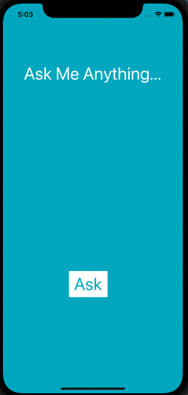
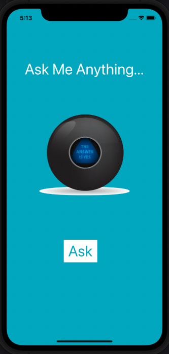

# Ask Me
The "Ask Me" is simple iOS application which shows answer on the screen everytime when the user press the ask button. This application is build and design by Chetan Parate using Xcode and Swift.

## What i have learnt while building "Ask Me" application?

--> How to link design with code via IBActions and IBOutlets.

--> I have learnt to detect user interaction through UIButtons.

--> How to use Swift variables, constants and collection types.

--> I have learned about randomisation in swift and range operators.

--> I have learned to use Image Literals in code.

--> I have learned to use Swift Playgrounds.

--> I have learned about the data type system and the primitive data types such as Strings, Ints and Doubles.

## Screenshots

